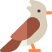

# Welcome to Skylark
Skylark is a collection of tools and resources that can help with developing .NET projects. It is designed to be lightweight, easy to use, and not too complicated or resource-intensive. It can be useful for developers who are new to .NET or who want to quickly set up a new project without having to spend a lot of time configuring everything from scratch.

## Contributors

Thanks goes to these wonderful people ([emoji key](https://allcontributors.org/docs/en/emoji-key)):

<table>
  <tr>
    <td align="center">
		<a href="https://github.com/Taiizor">
			
			 
			
				<b>Taiizor</b>
			
		</a>
		 
		<a href="https://github.com/Taiizor/Skylark/commits?author=Taiizor" title="Code">💻</a>
		<a href="https://www.taiizor.com" title="Ideas & Planning, Feedback">🤔</a>
	</td>
  </tr>
</table>

This project follows the [all contributors](https://github.com/all-contributors/all-contributors) specification. Contributions of any kind welcome!

## Backers

<table>
  <tr>
    <td align="center">
		<a href="https://github.com/Vegalya">
			
			 
			
				<b>Vegalya</b>
			
		</a>
		 
		<a href="https://github.com/Vegalya" target="_blank" title="Content">🖋</a>
	</td>
    <td align="center">
		<a href="https://github.com/Soferity">
			
			 
			
				<b>Soferity</b>
			
		</a>
		 
		<a href="https://github.com/Soferity" target="_blank" title="Content">🖋</a>
	</td>
  </tr>
</table>

## Documentation and FAQ

To learn more about Skylark, check out the [documentation](https://github.com/Taiizor/Skylark/wiki) - you'll find information there on the most common scenarios. If Skylark isn't working the way you expect, you may find the [troubleshooting guide](https://github.com/Taiizor/Skylark/wiki/Debugging-and-Diagnostics) useful.

## Contributing

Would you like to help make Skylark even better? We keep a list of issues that are approachable for newcomers under the [solved](https://github.com/Taiizor/Skylark/issues?q=is%3Aissue+label%3Asolved) label (accessible only when logged into GitHub). Before starting work on a pull request, we suggest commenting on, or raising, an issue on the issue tracker so that we can help and coordinate efforts.

When contributing please keep in mind our [Code of Conduct](CODE_OF_CONDUCT.md).

_Skylark is copyright &copy; 2022-2023 Skylark Contributors - Provided under the [MIT License](https://github.com/Taiizor/Skylark/blob/develop/LICENSE)._